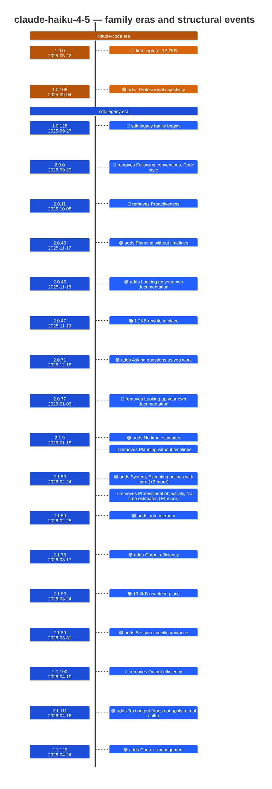

# claude-haiku-4-5

Generated 2026-08-13 by `bun run models` — regenerate, don't edit. Spine: sdk-cli tree.

| | |
| --- | --- |
| captured versions | 389 (1.0.0 → 2.1.229) |
| launch | predates the corpus (already present at 1.0.0) |
| current prompt | 27708B, 11 sections, family `sdk-legacy` |
| prompt changes | 96 across 388 captured transitions (25%) |

## Entrypoint comparison — interactive (cli) vs headless (sdk-cli)

92 versions captured in both trees (2.1.0 → 2.1.229), grouped into runs by family pair and section divergence:

| versions | dates | family cli / sdk | cli-only sections | sdk-only sections | Δ bytes (cli−sdk) |
| --- | --- | --- | --- | --- | --- |
| 2.1.0 – 2.1.12 | 2026-01-07 → 2026-01-17 | claude-code / sdk-legacy | — | — | -5 |
| 2.1.16 – 2.1.52 | 2026-01-22 → 2026-02-24 | claude-code / sdk-legacy | — | `Task Management` | -2457 … -2450 |
| 2.1.53 – 2.1.229 | 2026-02-24 → 2026-08-12 | claude-code / sdk-legacy | — | — | -289 … +260 |

**Parity verdict at 2.1.229: no doctrinal divergence.** Section sets identical; Δ +253B is the known surface delta (identity line, `!`-prefix tip, shell fact).

Interactive holes — honest exclusions, not gaps: 1.0.0 (model-remapped → claude-opus-4-20250514).

## Prompt timeline

Era colors (background): **amber** claude-code · **blue** sdk-legacy · **green** harness. Event glyphs: 🟢 section added · 🔴 section removed · 🟠 rewrite in place · 🔷 family flip · ⚪ first capture.

Full change-point table (the diagram shows structural events only; rewordings appear below):

| version | date | bytes | Δ | what changed |
| --- | --- | ---: | ---: | --- |
| 1.0.0 | 2025-05-22 | 13049 |  | (first capture) |
| 1.0.4 | 2025-05-28 | 13141 | +92 | ~[(intro), Tool usage policy] |
| 1.0.5 | 2025-05-28 | 13142 | +1 | ~[Tool usage policy] |
| 1.0.7 | 2025-05-30 | 13248 | +106 | ~[Tone and style] |
| 1.0.20 | 2025-06-11 | 13018 | -230 | ~[Task Management, Tool usage policy, Code References] |
| 1.0.31 | 2025-06-20 | 12497 | -521 | ~[(intro), Tool usage policy] |
| 1.0.34 | 2025-06-24 | 12499 | +2 | ~[Doing tasks] |
| 1.0.35 | 2025-06-25 | 12218 | -281 | ~[Tone and style, Tool usage policy] |
| 1.0.38 | 2025-06-30 | 12485 | +267 | ~[Task Management] |
| 1.0.42 | 2025-07-03 | 12656 | +171 | ~[Tool usage policy] |
| 1.0.44 | 2025-07-07 | 12643 | -13 | ~[Task Management, Tool usage policy] |
| 1.0.45 | 2025-07-08 | 12644 | +1 | ~[Tool usage policy] |
| 1.0.49 | 2025-07-11 | 12643 | -1 | ~[Tool usage policy] |
| 1.0.53 | 2025-07-15 | 13030 | +387 | ~[Task Management, Tool usage policy] |
| 1.0.59 | 2025-07-23 | 13027 | -3 | ~[Tone and style, Proactiveness] |
| 1.0.60 | 2025-07-24 | 13149 | +122 | ~[Tool usage policy] |
| 1.0.63 | 2025-07-29 | 13015 | -134 | ~[Tone and style, Tool usage policy] |
| 1.0.64 | 2025-07-30 | 12718 | -297 | ~[Tool usage policy] |
| 1.0.70 | 2025-08-06 | 12710 | -8 | ~[Tone and style] |
| 1.0.87 | 2025-08-21 | 12245 | -465 | ~[(intro)] |
| 1.0.98 | 2025-08-29 | 12519 | +274 | ~[(intro), Tool usage policy] |
| 1.0.106 | 2025-09-04 | 13156 | +637 | +[Professional objectivity] ~[Tone and style] |
| 1.0.111 | 2025-09-10 | 13414 | +258 | ~[Tool usage policy] |
| 1.0.119 | 2025-09-18 | 13486 | +72 | ~[Doing tasks] |
| 1.0.120 | 2025-09-19 | 13483 | -3 | ~[(intro)] |
| 1.0.127 | 2025-09-26 | 13485 | +2 | ~[Professional objectivity, Doing tasks] |
| 1.0.128 | 2025-09-27 | 13817 | +332 | family claude-code→sdk-legacy ~[(intro), Tone and style, Tool usage policy, Code References] |
| 2.0.0 | 2025-09-29 | 12274 | -1543 | −[Following conventions, Code style] ~[Professional objectivity, Doing tasks, Tool usage policy] |
| 2.0.2 | 2025-09-30 | 12409 | +135 | ~[Tool usage policy] |
| 2.0.5 | 2025-10-02 | 12274 | -135 | ~[Tool usage policy] |
| 2.0.8 | 2025-10-04 | 12409 | +135 | ~[Tool usage policy] |
| 2.0.11 | 2025-10-08 | 8772 | -3637 | −[Proactiveness] ~[(intro), Tone and style, Task Management] |
| 2.0.12 | 2025-10-09 | 8773 | +1 | ~[(intro), Task Management, Doing tasks] |
| 2.0.14 | 2025-10-10 | 9192 | +419 | ~[Tone and style] |
| 2.0.17 | 2025-10-15 | 9825 | +633 | ~[Tool usage policy] |
| 2.0.24 | 2025-10-20 | 9991 | +166 | ~[(intro), Tool usage policy] |
| 2.0.28 | 2025-10-27 | 10126 | +135 | ~[Professional objectivity] |
| 2.0.30 | 2025-10-30 | 10332 | +206 | ~[Doing tasks] |
| 2.0.31 | 2025-10-31 | 10485 | +153 | ~[Tool usage policy] |
| 2.0.33 | 2025-11-04 | 10484 | -1 | ~[Tool usage policy] |
| 2.0.34 | 2025-11-05 | 10489 | +5 | ~[Task Management, Doing tasks] |
| 2.0.36 | 2025-11-07 | 10486 | -3 | ~[Doing tasks] |
| 2.0.41 | 2025-11-14 | 10474 | -12 | ~[(intro)] |
| 2.0.43 | 2025-11-17 | 10964 | +490 | +[Planning without timelines] ~[Doing tasks] |
| 2.0.45 | 2025-11-18 | 11203 | +239 | +[Looking up your own documentation:] ~[(intro)] |
| 2.0.47 | 2025-11-19 | 12393 | +1190 | ~[Doing tasks] |
| 2.0.56 | 2025-12-01 | 12467 | +74 | ~[Doing tasks] |
| 2.0.58 | 2025-12-03 | 12463 | -4 | ~[Tool usage policy] |
| 2.0.60 | 2025-12-05 | 12463 | +0 | ~[Tool usage policy, Code References] |
| 2.0.62 | 2025-12-09 | 12753 | +290 | ~[Doing tasks] |
| 2.0.68 | 2025-12-12 | 12970 | +217 | ~[Tone and style] |
| 2.0.71 | 2025-12-16 | 13392 | +422 | +[Asking questions as you work] ~[Task Management, Doing tasks] |
| 2.0.73 | 2025-12-18 | 13094 | -298 | ~[Looking up your own documentation:, Doing tasks] |
| 2.0.75 | 2025-12-20 | 12877 | -217 | ~[Tone and style] |
| 2.0.77 | 2026-01-06 | 12422 | -455 | −[Looking up your own documentation:] ~[Tone and style, Tool usage policy, Code References] |
| 2.1.9 | 2026-01-15 | 12579 | +157 | +[No time estimates] −[Planning without timelines] |
| 2.1.20 | 2026-01-27 | 12406 | -173 | ~[(intro), Task Management, Asking questions as you work, Doing tasks, Tool usage policy, Code References] |
| 2.1.23 | 2026-01-29 | 12571 | +165 | ~[(intro), Tool usage policy] |
| 2.1.32 | 2026-02-05 | 12562 | -9 | ~[Code References] |
| 2.1.36 | 2026-02-07 | 12751 | +189 | ~[Code References] |
| 2.1.41 | 2026-02-13 | 12769 | +18 | ~[Tool usage policy] |
| 2.1.42 | 2026-02-13 | 12759 | -10 | ~[Code References] |
| 2.1.47 | 2026-02-18 | 13067 | +308 | ~[Tool usage policy] |
| 2.1.51 | 2026-02-23 | 12759 | -308 | ~[Tool usage policy] |
| 2.1.53 | 2026-02-24 | 12491 | -268 | +[System, Executing actions with care, Using your tools, Environment] −[Professional objectivity, No time estimates, Task Management, Asking questions as you work, Tool usage policy, Code References] ~[(intro), Doing tasks, Tone and style] |
| 2.1.59 | 2026-02-25 | 14273 | +1782 | +[auto memory] |
| 2.1.63 | 2026-02-28 | 14584 | +311 | ~[Using your tools] |
| 2.1.69 | 2026-03-04 | 14848 | +264 | ~[auto memory] |
| 2.1.72 | 2026-03-09 | 15010 | +162 | ~[Using your tools, Environment] |
| 2.1.74 | 2026-03-11 | 15132 | +122 | ~[auto memory] |
| 2.1.78 | 2026-03-17 | 16076 | +944 | +[Output efficiency] ~[Executing actions with care] |
| 2.1.83 | 2026-03-24 | 26664 | +10588 | ~[auto memory, Environment] |
| 2.1.84 | 2026-03-25 | 26682 | +18 | ~[Doing tasks, Tone and style] |
| 2.1.86 | 2026-03-27 | 26763 | +81 | ~[Doing tasks] |
| 2.1.89 | 2026-03-31 | 26795 | +32 | +[Session-specific guidance] ~[System, Using your tools] |
| 2.1.94 | 2026-04-07 | 26759 | -36 | ~[auto memory] |
| 2.1.97 | 2026-04-08 | 26763 | +4 | ~[Environment] |
| 2.1.100 | 2026-04-10 | 26029 | -734 | −[Output efficiency] |
| 2.1.101 | 2026-04-10 | 26420 | +391 | ~[Doing tasks] |
| 2.1.111 | 2026-04-16 | 25985 | -435 | +[Text output (does not apply to tool calls)] ~[Doing tasks, Using your tools, Tone and style, Session-specific guidance, Environment] |
| 2.1.116 | 2026-04-20 | 25849 | -136 | ~[Environment] |
| 2.1.120 | 2026-04-24 | 25869 | +20 | +[Context management] ~[Environment] |
| 2.1.139 | 2026-05-11 | 26277 | +408 | ~[auto memory, Context management] |
| 2.1.140 | 2026-05-12 | 26281 | +4 | ~[Environment] |
| 2.1.142 | 2026-05-14 | 26282 | +1 | ~[Using your tools] |
| 2.1.154 | 2026-05-28 | 26277 | -5 | ~[Environment] |
| 2.1.162 | 2026-06-03 | 26283 | +6 | ~[Using your tools, Session-specific guidance] |
| 2.1.169 | 2026-06-08 | 26562 | +279 | ~[Context management] |
| 2.1.170 | 2026-06-09 | 26607 | +45 | ~[Environment] |
| 2.1.196 | 2026-06-29 | 26603 | -4 | ~[Environment] |
| 2.1.197 | 2026-06-30 | 26610 | +7 | ~[Environment] |
| 2.1.198 | 2026-07-01 | 27115 | +505 | ~[Executing actions with care] |
| 2.1.200 | 2026-07-03 | 27365 | +250 | ~[Executing actions with care] |
| 2.1.208 | 2026-07-13 | 27728 | +363 | ~[Text output (does not apply to tool calls)] |
| 2.1.219 | 2026-07-24 | 27715 | -13 | ~[Environment] |
| 2.1.221 | 2026-08-03 | 27711 | -4 | ~[Environment] |
| 2.1.227 | 2026-08-10 | 27708 | -3 | ~[auto memory] |

## Durable content (top lineages across change-points)

| survived | rewordings | first | last | current wording (head) |
| ---: | ---: | --- | --- | --- |
| 97/97 | 0 | 1.0.0 | 2.1.227 | If the user asks for help or wants to give feedback inform them of the following: |
| 97/97 | 0 | 1.0.0 | 2.1.227 | IMPORTANT: You must NEVER generate or guess URLs for the user unless you are confident tha… |
| 97/97 | 2 | 1.0.0 | 2.1.227 | Mark each task completed as soon as it's done; don't batch. |
| 97/97 | 1 | 1.0.0 | 2.1.227 | Primary working directory: /tmp/system-prompt-capture-workspace |
| 97/97 | 1 | 1.0.0 | 2.1.227 | The user will primarily request you to perform software engineering tasks. |
| 97/97 | 1 | 1.0.0 | 2.1.227 | These may include solving bugs, adding new functionality, refactoring code, explaining cod… |
| 97/97 | 0 | 1.0.0 | 2.1.227 | To give feedback, users should report the issue at https://github.com/anthropics/claude-co… |
| 97/97 | 1 | 1.0.0 | 2.1.227 | Tool results and user messages may include <system-reminder> or other tags. |
| 97/97 | 0 | 1.0.0 | 2.1.227 | Use the instructions below and the tools available to you to assist the user. |
| 97/97 | 1 | 1.0.0 | 2.1.227 | When referencing specific functions or pieces of code include the pattern file_path:line_n… |

## Fleet position at 2.1.229

- family: `sdk-legacy` (7 of 10 models)
- sections ONLY this model has: none
- sections EVERY sibling has and this model lacks: none
- tools: 24; model-specific definitions (no sibling matches): `Bash`

