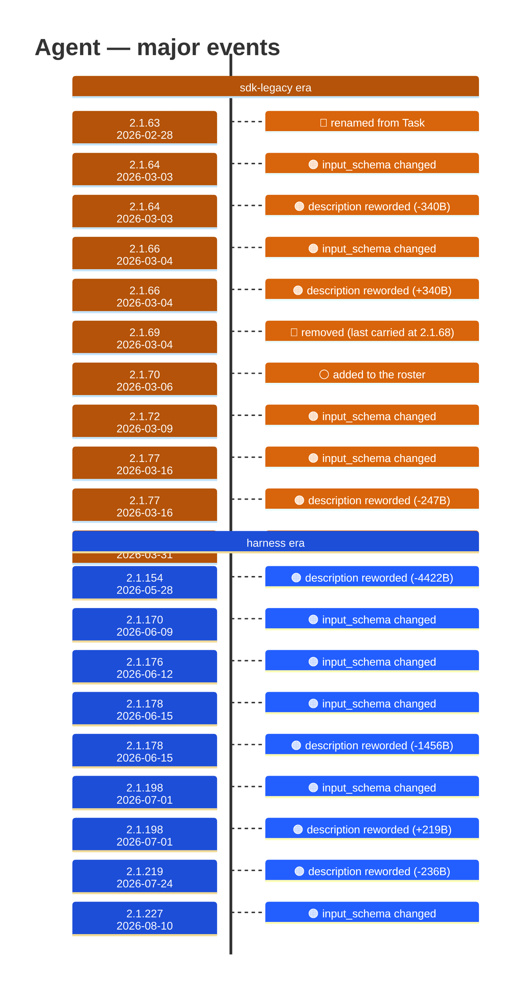

# Agent

Generated 2026-08-14 by `bun run tool-docs` — regenerate, don't edit. Spine: `claude-opus-5`, sdk tree.

| | |
| --- | --- |
| first seen | 2.1.63 (2026-02-28) |
| status | **active** at 2.1.229 |
| versions present | 141 of 389 |
| description rewrites | 16 · schema changes: 9 |

Era colors: **amber** claude-code · **blue** sdk-legacy · **green** harness. Glyphs: ⚪ born · 🔴 removed · 🟠 rewrite/schema · 🔷 rename.

## Change log (all events)

| version | date | event |
| --- | --- | --- |
| 2.1.63 | 2026-02-28 | renamed from Task |
| 2.1.64 | 2026-03-03 | input_schema changed |
| 2.1.64 | 2026-03-03 | description reworded (-340B) |
| 2.1.66 | 2026-03-04 | input_schema changed |
| 2.1.66 | 2026-03-04 | description reworded (+340B) |
| 2.1.69 | 2026-03-04 | removed (last carried at 2.1.68) |
| 2.1.70 | 2026-03-06 | added to the roster |
| 2.1.71 | 2026-03-06 | description reworded (+9B) |
| 2.1.72 | 2026-03-09 | input_schema changed |
| 2.1.77 | 2026-03-16 | input_schema changed |
| 2.1.77 | 2026-03-16 | description reworded (-247B) |
| 2.1.89 | 2026-03-31 | description reworded (+918B) |
| 2.1.94 | 2026-04-07 | description reworded (+119B) |
| 2.1.105 | 2026-04-13 | description reworded (+194B) |
| 2.1.111 | 2026-04-16 | description reworded (+0B) |
| 2.1.120 | 2026-04-24 | description reworded (+123B) |
| 2.1.139 | 2026-05-11 | description reworded (+133B) |
| 2.1.154 | 2026-05-28 | description reworded (-4422B) |
| 2.1.170 | 2026-06-09 | input_schema changed |
| 2.1.176 | 2026-06-12 | input_schema changed |
| 2.1.178 | 2026-06-15 | input_schema changed |
| 2.1.178 | 2026-06-15 | description reworded (-1456B) |
| 2.1.198 | 2026-07-01 | input_schema changed |
| 2.1.198 | 2026-07-01 | description reworded (+219B) |
| 2.1.211 | 2026-07-15 | description reworded (+130B) |
| 2.1.219 | 2026-07-24 | description reworded (-236B) |
| 2.1.227 | 2026-08-10 | input_schema changed |
| 2.1.227 | 2026-08-10 | description reworded (+96B) |

## Variants at 2.1.229

3 distinct definitions:

- `claude-haiku-4-5`, `claude-opus-4-5`, `claude-opus-4-6`, `claude-opus-4-7`, `claude-sonnet-4-5`, `claude-sonnet-4-6`, `claude-sonnet-5`
- `claude-fable-5`, `claude-opus-4-8`
- `claude-opus-5`

Lines the `claude-fable-5`, `claude-opus-4-8` variant lacks vs the majority:

> If the target is already known, use the direct tool: Read for a known path, `grep` via the Bash tool for a specific symbol or string. Reserv
> - Always include a short description summarizing what the agent will do
> - When the agent is done, its final report is not visible to the user. To show the user the result, you should send a text message back to t
> - Trust but verify: an agent's summary describes what it intended to do, not necessarily what it did. When an agent writes or edits code, ch
> - Agents run in the background by default. When an agent runs in the background, you will be automatically notified when it completes — do N
> - **Foreground vs background**: Pass `run_in_background: false` only when your very next action depends on the agent's result and nothing el
> - **Don't race**: after launching a background agent, you know nothing about its results. Never fabricate or predict them in any format — no
> - To continue a previously spawned agent, use SendMessage with the agent's ID or name as the `to` field — that resumes it with full context.
> _…and 31 more_

Lines the `claude-opus-5` variant lacks vs the majority:

> If the target is already known, use the direct tool: Read for a known path, `grep` via the Bash tool for a specific symbol or string. Reserv
> - Always include a short description summarizing what the agent will do
> - When the agent is done, its final report is not visible to the user. To show the user the result, you should send a text message back to t
> - Trust but verify: an agent's summary describes what it intended to do, not necessarily what it did. When an agent writes or edits code, ch
> - Agents run in the background by default. When an agent runs in the background, you will be automatically notified when it completes — do N
> - **Foreground vs background**: Pass `run_in_background: false` only when your very next action depends on the agent's result and nothing el
> - **Don't race**: after launching a background agent, you know nothing about its results. Never fabricate or predict them in any format — no
> - To continue a previously spawned agent, use SendMessage with the agent's ID or name as the `to` field — that resumes it with full context.
> _…and 31 more_

