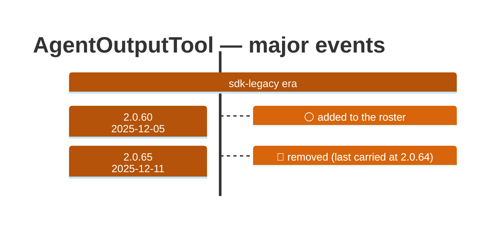

# AgentOutputTool

Generated 2026-08-14 by `bun run tool-docs` — regenerate, don't edit. Spine: `claude-opus-5`, sdk tree.

| | |
| --- | --- |
| first seen | 2.0.60 (2025-12-05) |
| last seen | **removed** — last carried at 2.0.64 (2025-12-10) |
| versions present | 5 of 389 |
| description rewrites | 0 · schema changes: 0 |

Era colors: **amber** claude-code · **blue** sdk-legacy · **green** harness. Glyphs: ⚪ born · 🔴 removed · 🟠 rewrite/schema · 🔷 rename.

## Change log (all events)

| version | date | event |
| --- | --- | --- |
| 2.0.60 | 2025-12-05 | added to the roster |
| 2.0.65 | 2025-12-11 | removed (last carried at 2.0.64) |

