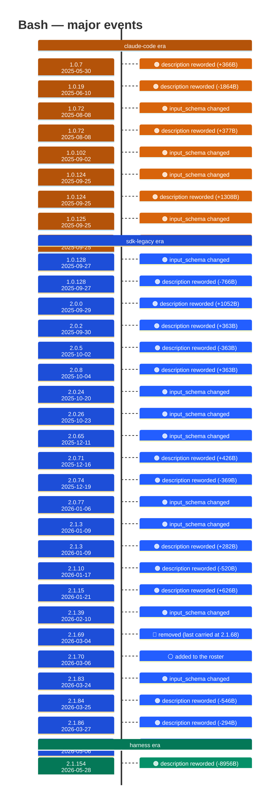

# Bash

Generated 2026-08-13 by `bun run tool-docs` — regenerate, don't edit. Spine: `claude-opus-5`, sdk tree.

| | |
| --- | --- |
| first seen | 1.0.0 (2025-05-22) — present from the corpus start |
| status | **active** at 2.1.229 |
| versions present | 388 of 389 |
| description rewrites | 63 · schema changes: 13 |

Era colors: **amber** claude-code · **blue** sdk-legacy · **green** harness. Glyphs: ⚪ born · 🔴 removed · 🟠 rewrite/schema · 🔷 rename.

## Change log (all events)

| version | date | event |
| --- | --- | --- |
| 1.0.1 | 2025-05-22 | description reworded (+0B) |
| 1.0.2 | 2025-05-22 | description reworded (+0B) |
| 1.0.3 | 2025-05-23 | description reworded (+0B) |
| 1.0.4 | 2025-05-28 | description reworded (-1B) |
| 1.0.5 | 2025-05-28 | description reworded (+0B) |
| 1.0.6 | 2025-05-29 | description reworded (+0B) |
| 1.0.7 | 2025-05-30 | description reworded (+366B) |
| 1.0.8 | 2025-06-02 | description reworded (+0B) |
| 1.0.9 | 2025-06-02 | description reworded (+0B) |
| 1.0.10 | 2025-06-03 | description reworded (+1B) |
| 1.0.11 | 2025-06-04 | description reworded (+0B) |
| 1.0.14 | 2025-06-05 | description reworded (+0B) |
| 1.0.15 | 2025-06-05 | description reworded (+0B) |
| 1.0.16 | 2025-06-06 | description reworded (+0B) |
| 1.0.17 | 2025-06-06 | description reworded (+0B) |
| 1.0.18 | 2025-06-09 | description reworded (-95B) |
| 1.0.19 | 2025-06-10 | description reworded (-1864B) |
| 1.0.22 | 2025-06-12 | description reworded (-18B) |
| 1.0.23 | 2025-06-13 | description reworded (-12B) |
| 1.0.35 | 2025-06-25 | description reworded (+3B) |
| 1.0.68 | 2025-08-04 | description reworded (-4B) |
| 1.0.72 | 2025-08-08 | input_schema changed |
| 1.0.72 | 2025-08-08 | description reworded (+377B) |
| 1.0.81 | 2025-08-14 | description reworded (-2B) |
| 1.0.98 | 2025-08-29 | description reworded (-13B) |
| 1.0.102 | 2025-09-02 | input_schema changed |
| 1.0.103 | 2025-09-03 | description reworded (-1B) |
| 1.0.108 | 2025-09-05 | description reworded (-1B) |
| 1.0.122 | 2025-09-23 | description reworded (+1B) |
| 1.0.124 | 2025-09-25 | input_schema changed |
| 1.0.124 | 2025-09-25 | description reworded (+1308B) |
| 1.0.125 | 2025-09-25 | input_schema changed |
| 1.0.125 | 2025-09-25 | description reworded (+292B) |
| 1.0.128 | 2025-09-27 | input_schema changed |
| 1.0.128 | 2025-09-27 | description reworded (-766B) |
| 2.0.0 | 2025-09-29 | description reworded (+1052B) |
| 2.0.2 | 2025-09-30 | description reworded (+363B) |
| 2.0.5 | 2025-10-02 | description reworded (-363B) |
| 2.0.8 | 2025-10-04 | description reworded (+363B) |
| 2.0.24 | 2025-10-20 | input_schema changed |
| 2.0.25 | 2025-10-21 | description reworded (-76B) |
| 2.0.26 | 2025-10-23 | input_schema changed |
| 2.0.56 | 2025-12-01 | description reworded (+44B) |
| 2.0.65 | 2025-12-11 | input_schema changed |
| 2.0.71 | 2025-12-16 | description reworded (+426B) |
| 2.0.74 | 2025-12-19 | description reworded (-369B) |
| 2.0.77 | 2026-01-06 | input_schema changed |
| 2.0.77 | 2026-01-06 | description reworded (-73B) |
| 2.1.3 | 2026-01-09 | input_schema changed |
| 2.1.3 | 2026-01-09 | description reworded (+282B) |
| 2.1.4 | 2026-01-10 | description reworded (+3B) |
| 2.1.10 | 2026-01-17 | description reworded (-520B) |
| 2.1.14 | 2026-01-20 | description reworded (+83B) |
| 2.1.15 | 2026-01-21 | description reworded (+626B) |
| 2.1.16 | 2026-01-22 | description reworded (+120B) |
| 2.1.20 | 2026-01-27 | description reworded (+151B) |
| 2.1.26 | 2026-01-30 | description reworded (-14B) |
| 2.1.32 | 2026-02-05 | description reworded (+0B) |
| 2.1.38 | 2026-02-10 | description reworded (-1B) |
| 2.1.39 | 2026-02-10 | input_schema changed |
| 2.1.53 | 2026-02-24 | description reworded (+199B) |
| 2.1.63 | 2026-02-28 | description reworded (+0B) |
| 2.1.69 | 2026-03-04 | removed (last carried at 2.1.68) |
| 2.1.70 | 2026-03-06 | added to the roster |
| 2.1.75 | 2026-03-13 | description reworded (-85B) |
| 2.1.83 | 2026-03-24 | input_schema changed |
| 2.1.84 | 2026-03-25 | description reworded (-546B) |
| 2.1.86 | 2026-03-27 | description reworded (-294B) |
| 2.1.108 | 2026-04-14 | description reworded (-14B) |
| 2.1.111 | 2026-04-16 | description reworded (+0B) |
| 2.1.113 | 2026-04-17 | description reworded (+176B) |
| 2.1.132 | 2026-05-06 | input_schema changed |
| 2.1.142 | 2026-05-14 | description reworded (+2B) |
| 2.1.154 | 2026-05-28 | description reworded (-8956B) |
| 2.1.162 | 2026-06-03 | description reworded (-16B) |
| 2.1.170 | 2026-06-09 | description reworded (-1B) |
| 2.1.172 | 2026-06-10 | description reworded (-8B) |
| 2.1.219 | 2026-07-24 | description reworded (+71B) |

## Variants at 2.1.229

10 distinct definitions:

- `claude-fable-5`
- `claude-haiku-4-5`
- `claude-opus-4-5`
- `claude-opus-4-6`
- `claude-opus-4-7`
- `claude-opus-4-8`
- `claude-opus-5`
- `claude-sonnet-4-5`
- `claude-sonnet-4-6`
- `claude-sonnet-5`

Lines the `claude-haiku-4-5` variant lacks vs the majority:

> Executes a bash command and returns its output.
> - Working directory persists between calls, but prefer absolute paths — `cd` in a compound command can trigger a permission prompt. Shell st
> - IMPORTANT: Avoid using this tool to run `cat`, `head`, `tail`, `sed`, `awk`, or `echo` commands, unless explicitly instructed or after you
> - Command output is displayed to you, not reliably to the user.
> - `timeout` is in milliseconds: default 120000, max 600000.
> - `run_in_background` runs the command detached: it keeps running across turns and re-invokes you when it exits. No `&` needed.
> - Interactive flags (`-i`, e.g. `git rebase -i`, `git add -i`) are not supported in this environment.
> - Use the `gh` CLI for GitHub operations (PRs, issues, API).
> _…and 4 more_

Lines the `claude-opus-4-5` variant lacks vs the majority:

> Executes a bash command and returns its output.
> - Working directory persists between calls, but prefer absolute paths — `cd` in a compound command can trigger a permission prompt. Shell st
> - IMPORTANT: Avoid using this tool to run `cat`, `head`, `tail`, `sed`, `awk`, or `echo` commands, unless explicitly instructed or after you
> - Command output is displayed to you, not reliably to the user.
> - `timeout` is in milliseconds: default 120000, max 600000.
> - `run_in_background` runs the command detached: it keeps running across turns and re-invokes you when it exits. No `&` needed.
> - Interactive flags (`-i`, e.g. `git rebase -i`, `git add -i`) are not supported in this environment.
> - Use the `gh` CLI for GitHub operations (PRs, issues, API).
> _…and 4 more_

Lines the `claude-opus-4-6` variant lacks vs the majority:

> Executes a bash command and returns its output.
> - Working directory persists between calls, but prefer absolute paths — `cd` in a compound command can trigger a permission prompt. Shell st
> - IMPORTANT: Avoid using this tool to run `cat`, `head`, `tail`, `sed`, `awk`, or `echo` commands, unless explicitly instructed or after you
> - Command output is displayed to you, not reliably to the user.
> - `timeout` is in milliseconds: default 120000, max 600000.
> - `run_in_background` runs the command detached: it keeps running across turns and re-invokes you when it exits. No `&` needed.
> - Interactive flags (`-i`, e.g. `git rebase -i`, `git add -i`) are not supported in this environment.
> - Use the `gh` CLI for GitHub operations (PRs, issues, API).
> _…and 4 more_

Lines the `claude-opus-4-7` variant lacks vs the majority:

> Executes a bash command and returns its output.
> - Working directory persists between calls, but prefer absolute paths — `cd` in a compound command can trigger a permission prompt. Shell st
> - IMPORTANT: Avoid using this tool to run `cat`, `head`, `tail`, `sed`, `awk`, or `echo` commands, unless explicitly instructed or after you
> - Command output is displayed to you, not reliably to the user.
> - `timeout` is in milliseconds: default 120000, max 600000.
> - `run_in_background` runs the command detached: it keeps running across turns and re-invokes you when it exits. No `&` needed.
> - Interactive flags (`-i`, e.g. `git rebase -i`, `git add -i`) are not supported in this environment.
> - Use the `gh` CLI for GitHub operations (PRs, issues, API).
> _…and 4 more_

Lines the `claude-opus-4-8` variant lacks vs the majority:

> Co-Authored-By: Claude Fable 5 <noreply@anthropic.com>

Lines the `claude-opus-5` variant lacks vs the majority:

> Co-Authored-By: Claude Fable 5 <noreply@anthropic.com>

Lines the `claude-sonnet-4-5` variant lacks vs the majority:

> Executes a bash command and returns its output.
> - Working directory persists between calls, but prefer absolute paths — `cd` in a compound command can trigger a permission prompt. Shell st
> - IMPORTANT: Avoid using this tool to run `cat`, `head`, `tail`, `sed`, `awk`, or `echo` commands, unless explicitly instructed or after you
> - Command output is displayed to you, not reliably to the user.
> - `timeout` is in milliseconds: default 120000, max 600000.
> - `run_in_background` runs the command detached: it keeps running across turns and re-invokes you when it exits. No `&` needed.
> - Interactive flags (`-i`, e.g. `git rebase -i`, `git add -i`) are not supported in this environment.
> - Use the `gh` CLI for GitHub operations (PRs, issues, API).
> _…and 4 more_

Lines the `claude-sonnet-4-6` variant lacks vs the majority:

> Executes a bash command and returns its output.
> - Working directory persists between calls, but prefer absolute paths — `cd` in a compound command can trigger a permission prompt. Shell st
> - IMPORTANT: Avoid using this tool to run `cat`, `head`, `tail`, `sed`, `awk`, or `echo` commands, unless explicitly instructed or after you
> - Command output is displayed to you, not reliably to the user.
> - `timeout` is in milliseconds: default 120000, max 600000.
> - `run_in_background` runs the command detached: it keeps running across turns and re-invokes you when it exits. No `&` needed.
> - Interactive flags (`-i`, e.g. `git rebase -i`, `git add -i`) are not supported in this environment.
> - Use the `gh` CLI for GitHub operations (PRs, issues, API).
> _…and 4 more_

Lines the `claude-sonnet-5` variant lacks vs the majority:

> Executes a bash command and returns its output.
> - Working directory persists between calls, but prefer absolute paths — `cd` in a compound command can trigger a permission prompt. Shell st
> - IMPORTANT: Avoid using this tool to run `cat`, `head`, `tail`, `sed`, `awk`, or `echo` commands, unless explicitly instructed or after you
> - Command output is displayed to you, not reliably to the user.
> - `timeout` is in milliseconds: default 120000, max 600000.
> - `run_in_background` runs the command detached: it keeps running across turns and re-invokes you when it exits. No `&` needed.
> - Interactive flags (`-i`, e.g. `git rebase -i`, `git add -i`) are not supported in this environment.
> - Use the `gh` CLI for GitHub operations (PRs, issues, API).
> _…and 4 more_

