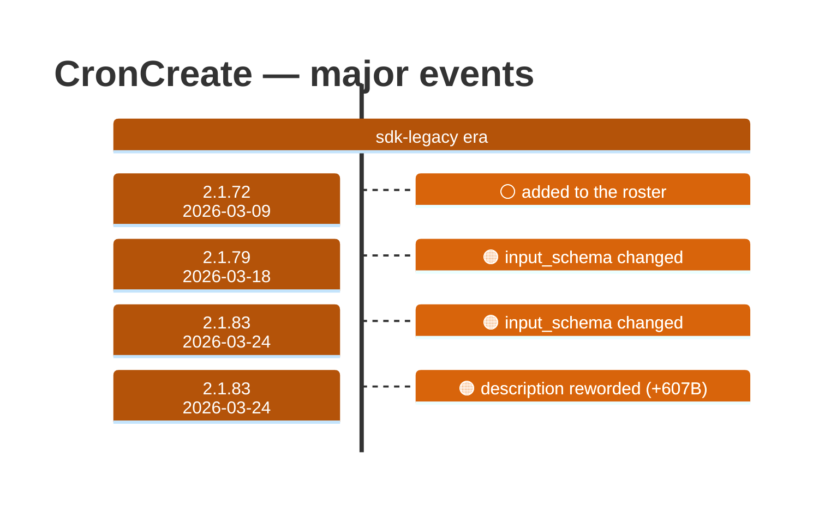

# CronCreate

Generated 2026-08-14 by `bun run tool-docs` — regenerate, don't edit. Spine: `claude-opus-5`, sdk tree.

| | |
| --- | --- |
| first seen | 2.1.72 (2026-03-09) |
| status | **active** at 2.1.229 |
| versions present | 134 of 389 |
| description rewrites | 2 · schema changes: 2 |

Era colors: **amber** claude-code · **blue** sdk-legacy · **green** harness. Glyphs: ⚪ born · 🔴 removed · 🟠 rewrite/schema · 🔷 rename.

## Change log (all events)

| version | date | event |
| --- | --- | --- |
| 2.1.72 | 2026-03-09 | added to the roster |
| 2.1.79 | 2026-03-18 | input_schema changed |
| 2.1.79 | 2026-03-18 | description reworded (+0B) |
| 2.1.83 | 2026-03-24 | input_schema changed |
| 2.1.83 | 2026-03-24 | description reworded (+607B) |

## Variants at 2.1.229

One definition across all 10 models.

