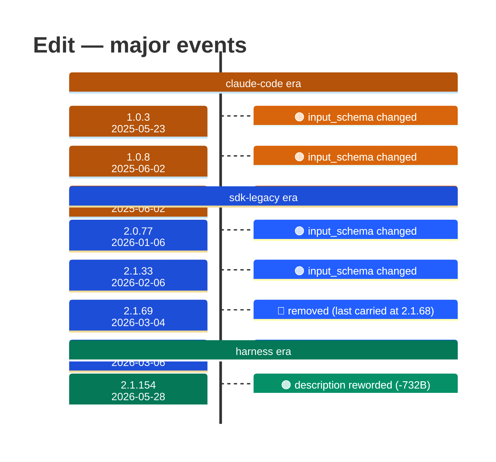

# Edit

Generated 2026-08-13 by `bun run tool-docs` — regenerate, don't edit. Spine: `claude-opus-5`, sdk tree.

| | |
| --- | --- |
| first seen | 1.0.0 (2025-05-22) — present from the corpus start |
| status | **active** at 2.1.229 |
| versions present | 388 of 389 |
| description rewrites | 6 · schema changes: 4 |

Era colors: **amber** claude-code · **blue** sdk-legacy · **green** harness. Glyphs: ⚪ born · 🔴 removed · 🟠 rewrite/schema · 🔷 rename.

## Change log (all events)

| version | date | event |
| --- | --- | --- |
| 1.0.3 | 2025-05-23 | input_schema changed |
| 1.0.7 | 2025-05-30 | description reworded (+97B) |
| 1.0.8 | 2025-06-02 | input_schema changed |
| 1.0.8 | 2025-06-02 | description reworded (+465B) |
| 2.0.77 | 2026-01-06 | input_schema changed |
| 2.1.20 | 2026-01-27 | description reworded (-2B) |
| 2.1.33 | 2026-02-06 | input_schema changed |
| 2.1.69 | 2026-03-04 | removed (last carried at 2.1.68) |
| 2.1.70 | 2026-03-06 | added to the roster |
| 2.1.86 | 2026-03-27 | description reworded (-13B) |
| 2.1.91 | 2026-04-02 | description reworded (-1B) |
| 2.1.154 | 2026-05-28 | description reworded (-732B) |

## Variants at 2.1.229

2 distinct definitions:

- `claude-haiku-4-5`, `claude-opus-4-5`, `claude-opus-4-6`, `claude-opus-4-7`, `claude-sonnet-4-5`, `claude-sonnet-4-6`, `claude-sonnet-5`
- `claude-fable-5`, `claude-opus-4-8`, `claude-opus-5`

Lines the `claude-fable-5`, `claude-opus-4-8`, `claude-opus-5` variant lacks vs the majority:

> Performs exact string replacements in files.
> - You must use your `Read` tool at least once in the conversation before editing. This tool will error if you attempt an edit without readin
> - When editing text from Read tool output, ensure you preserve the exact indentation (tabs/spaces) as it appears AFTER the line number prefi
> - ALWAYS prefer editing existing files in the codebase. NEVER write new files unless explicitly required.
> - Only use emojis if the user explicitly requests it. Avoid adding emojis to files unless asked.
> - The edit will FAIL if `old_string` is not unique in the file. Either provide a larger string with more surrounding context to make it uniq
> - Use `replace_all` for replacing and renaming strings across the file. This parameter is useful if you want to rename a variable for instan

