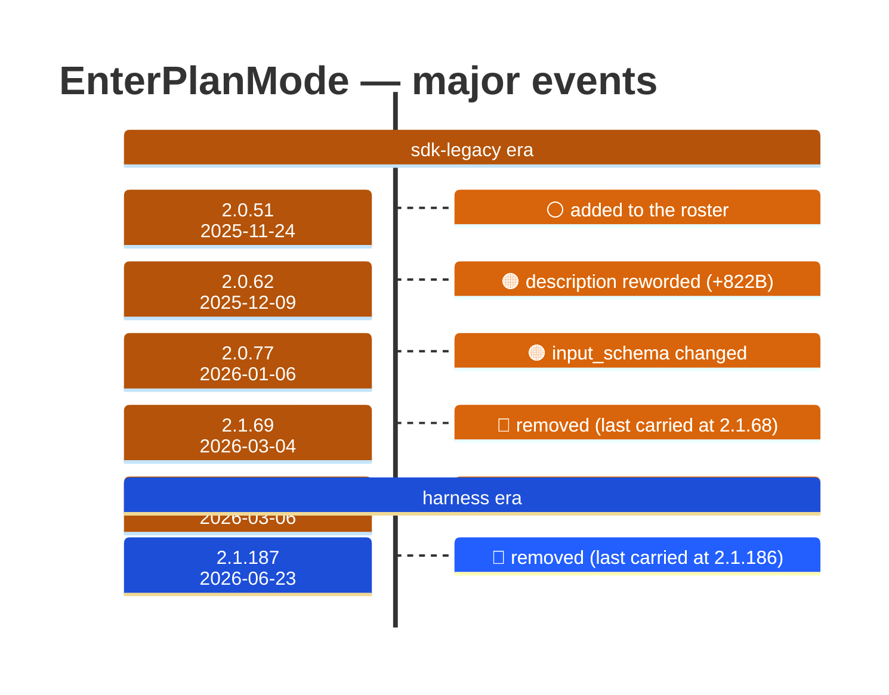

# EnterPlanMode

Generated 2026-08-14 by `bun run tool-docs` — regenerate, don't edit. Spine: `claude-opus-5`, sdk tree.

| | |
| --- | --- |
| first seen | 2.0.51 (2025-11-24) |
| last seen | **removed** — last carried at 2.1.186 (2026-06-22) |
| versions present | 185 of 389 |
| description rewrites | 4 · schema changes: 1 |

Era colors: **amber** claude-code · **blue** sdk-legacy · **green** harness. Glyphs: ⚪ born · 🔴 removed · 🟠 rewrite/schema · 🔷 rename.

## Change log (all events)

| version | date | event |
| --- | --- | --- |
| 2.0.51 | 2025-11-24 | added to the roster |
| 2.0.62 | 2025-12-09 | description reworded (+822B) |
| 2.0.77 | 2026-01-06 | input_schema changed |
| 2.1.63 | 2026-02-28 | description reworded (+1B) |
| 2.1.69 | 2026-03-04 | removed (last carried at 2.1.68) |
| 2.1.70 | 2026-03-06 | added to the roster |
| 2.1.129 | 2026-05-05 | description reworded (-6B) |
| 2.1.162 | 2026-06-03 | description reworded (+14B) |
| 2.1.187 | 2026-06-23 | removed (last carried at 2.1.186) |

