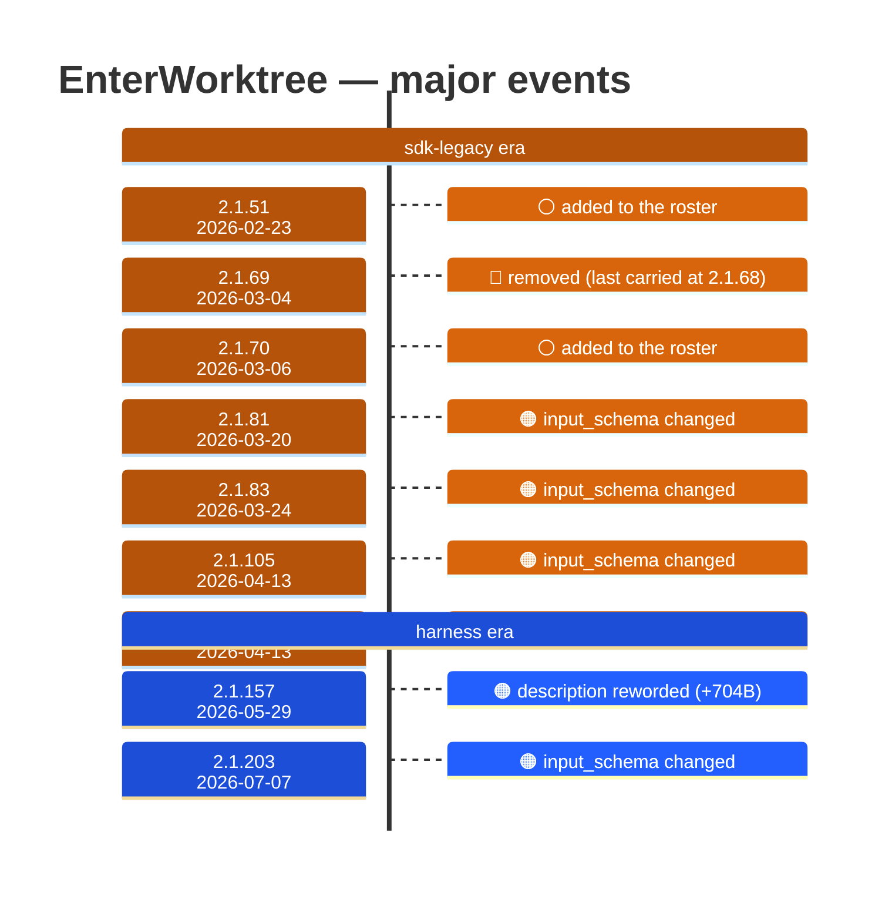

# EnterWorktree

Generated 2026-08-14 by `bun run tool-docs` — regenerate, don't edit. Spine: `claude-opus-5`, sdk tree.

| | |
| --- | --- |
| first seen | 2.1.51 (2026-02-23) |
| status | **active** at 2.1.232 |
| versions present | 153 of 391 |
| description rewrites | 5 · schema changes: 4 |

Era colors: **amber** claude-code · **blue** sdk-legacy · **green** harness. Glyphs: ⚪ born · 🔴 removed · 🟠 rewrite/schema · 🔷 rename.

## Change log (all events)

| version | date | event |
| --- | --- | --- |
| 2.1.51 | 2026-02-23 | added to the roster |
| 2.1.69 | 2026-03-04 | removed (last carried at 2.1.68) |
| 2.1.70 | 2026-03-06 | added to the roster |
| 2.1.72 | 2026-03-09 | description reworded (+85B) |
| 2.1.81 | 2026-03-20 | input_schema changed |
| 2.1.83 | 2026-03-24 | input_schema changed |
| 2.1.105 | 2026-04-13 | input_schema changed |
| 2.1.105 | 2026-04-13 | description reworded (+851B) |
| 2.1.133 | 2026-05-07 | description reworded (+147B) |
| 2.1.157 | 2026-05-29 | description reworded (+704B) |
| 2.1.203 | 2026-07-07 | input_schema changed |
| 2.1.203 | 2026-07-07 | description reworded (+191B) |

## Variants at 2.1.232

One definition across all 10 models.

