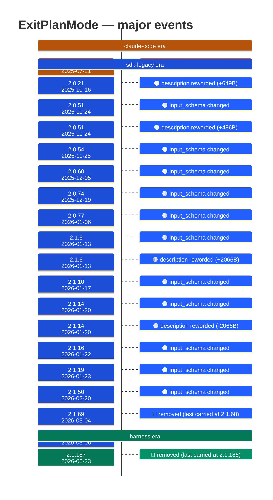

# ExitPlanMode

Generated 2026-08-13 by `bun run tool-docs` — regenerate, don't edit. Spine: `claude-opus-5`, sdk tree.

| | |
| --- | --- |
| first seen | 1.0.57 (2025-07-21) |
| last seen | **removed** — last carried at 2.1.186 (2026-06-22) |
| versions present | 294 of 389 |
| description rewrites | 8 · schema changes: 11 |

Era colors: **amber** claude-code · **blue** sdk-legacy · **green** harness. Glyphs: ⚪ born · 🔴 removed · 🟠 rewrite/schema · 🔷 rename.

## Change log (all events)

| version | date | event |
| --- | --- | --- |
| 1.0.57 | 2025-07-21 | renamed from exit_plan_mode |
| 2.0.10 | 2025-10-07 | description reworded (-2B) |
| 2.0.15 | 2025-10-14 | description reworded (+9B) |
| 2.0.21 | 2025-10-16 | description reworded (+649B) |
| 2.0.30 | 2025-10-30 | description reworded (-1B) |
| 2.0.51 | 2025-11-24 | input_schema changed |
| 2.0.51 | 2025-11-24 | description reworded (+486B) |
| 2.0.54 | 2025-11-25 | input_schema changed |
| 2.0.60 | 2025-12-05 | input_schema changed |
| 2.0.74 | 2025-12-19 | input_schema changed |
| 2.0.77 | 2026-01-06 | input_schema changed |
| 2.0.77 | 2026-01-06 | description reworded (-79B) |
| 2.1.6 | 2026-01-13 | input_schema changed |
| 2.1.6 | 2026-01-13 | description reworded (+2066B) |
| 2.1.10 | 2026-01-17 | input_schema changed |
| 2.1.14 | 2026-01-20 | input_schema changed |
| 2.1.14 | 2026-01-20 | description reworded (-2066B) |
| 2.1.16 | 2026-01-22 | input_schema changed |
| 2.1.19 | 2026-01-23 | input_schema changed |
| 2.1.50 | 2026-02-20 | input_schema changed |
| 2.1.69 | 2026-03-04 | removed (last carried at 2.1.68) |
| 2.1.70 | 2026-03-06 | added to the roster |
| 2.1.187 | 2026-06-23 | removed (last carried at 2.1.186) |

