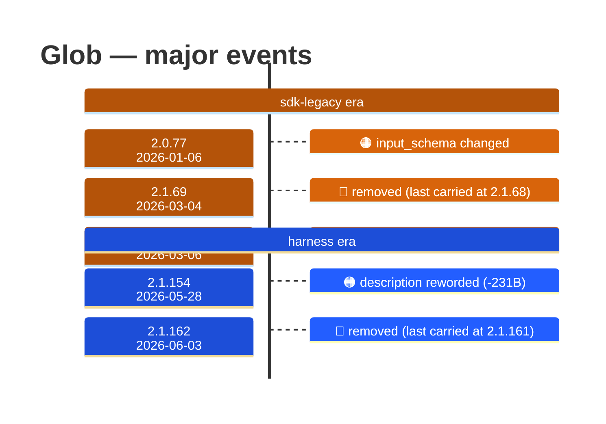

# Glob

Generated 2026-08-14 by `bun run tool-docs` — regenerate, don't edit. Spine: `claude-opus-5`, sdk tree.

| | |
| --- | --- |
| first seen | 1.0.0 (2025-05-22) — present from the corpus start |
| last seen | **removed** — last carried at 2.1.161 (2026-06-02) |
| versions present | 328 of 389 |
| description rewrites | 5 · schema changes: 1 |

Era colors: **amber** claude-code · **blue** sdk-legacy · **green** harness. Glyphs: ⚪ born · 🔴 removed · 🟠 rewrite/schema · 🔷 rename.

## Change log (all events)

| version | date | event |
| --- | --- | --- |
| 2.0.2 | 2025-09-30 | description reworded (-15B) |
| 2.0.5 | 2025-10-02 | description reworded (+15B) |
| 2.0.8 | 2025-10-04 | description reworded (-15B) |
| 2.0.77 | 2026-01-06 | input_schema changed |
| 2.1.69 | 2026-03-04 | removed (last carried at 2.1.68) |
| 2.1.70 | 2026-03-06 | added to the roster |
| 2.1.84 | 2026-03-25 | description reworded (-159B) |
| 2.1.154 | 2026-05-28 | description reworded (-231B) |
| 2.1.162 | 2026-06-03 | removed (last carried at 2.1.161) |

