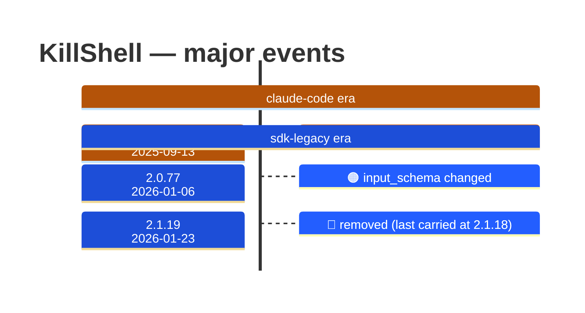

# KillShell

Generated 2026-08-14 by `bun run tool-docs` — regenerate, don't edit. Spine: `claude-opus-5`, sdk tree.

| | |
| --- | --- |
| first seen | 1.0.113 (2025-09-13) |
| last seen | **removed** — last carried at 2.1.18 (2026-01-22) |
| versions present | 103 of 389 |
| description rewrites | 1 · schema changes: 1 |

Era colors: **amber** claude-code · **blue** sdk-legacy · **green** harness. Glyphs: ⚪ born · 🔴 removed · 🟠 rewrite/schema · 🔷 rename.

## Change log (all events)

| version | date | event |
| --- | --- | --- |
| 1.0.113 | 2025-09-13 | renamed from KillBash |
| 2.0.45 | 2025-11-18 | description reworded (-1B) |
| 2.0.77 | 2026-01-06 | input_schema changed |
| 2.1.19 | 2026-01-23 | removed (last carried at 2.1.18) |

