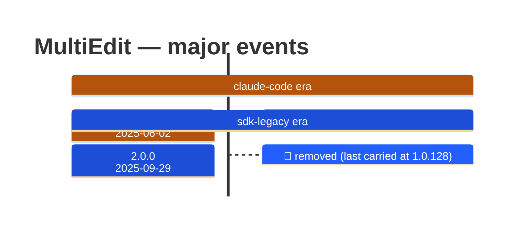

# MultiEdit

Generated 2026-08-14 by `bun run tool-docs` — regenerate, don't edit. Spine: `claude-opus-5`, sdk tree.

| | |
| --- | --- |
| first seen | 1.0.0 (2025-05-22) — present from the corpus start |
| last seen | **removed** — last carried at 1.0.128 (2025-09-27) |
| versions present | 121 of 391 |
| description rewrites | 2 · schema changes: 1 |

Era colors: **amber** claude-code · **blue** sdk-legacy · **green** harness. Glyphs: ⚪ born · 🔴 removed · 🟠 rewrite/schema · 🔷 rename.

## Change log (all events)

| version | date | event |
| --- | --- | --- |
| 1.0.7 | 2025-05-30 | description reworded (+97B) |
| 1.0.8 | 2025-06-02 | input_schema changed |
| 1.0.8 | 2025-06-02 | description reworded (-83B) |
| 2.0.0 | 2025-09-29 | removed (last carried at 1.0.128) |

