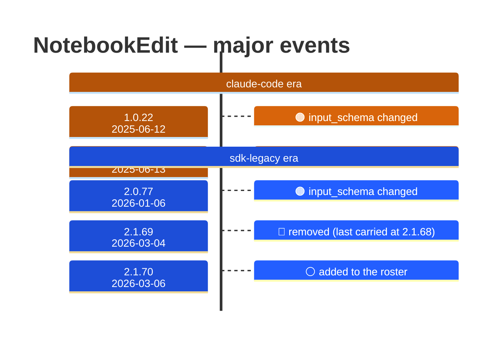

# NotebookEdit

Generated 2026-08-13 by `bun run tool-docs` — regenerate, don't edit. Spine: `claude-opus-5`, sdk tree.

| | |
| --- | --- |
| first seen | 1.0.0 (2025-05-22) — present from the corpus start |
| status | **active** at 2.1.229 |
| versions present | 388 of 389 |
| description rewrites | 1 · schema changes: 3 |

Era colors: **amber** claude-code · **blue** sdk-legacy · **green** harness. Glyphs: ⚪ born · 🔴 removed · 🟠 rewrite/schema · 🔷 rename.

## Change log (all events)

| version | date | event |
| --- | --- | --- |
| 1.0.22 | 2025-06-12 | input_schema changed |
| 1.0.23 | 2025-06-13 | input_schema changed |
| 2.0.77 | 2026-01-06 | input_schema changed |
| 2.1.69 | 2026-03-04 | removed (last carried at 2.1.68) |
| 2.1.70 | 2026-03-06 | added to the roster |
| 2.1.162 | 2026-06-03 | description reworded (+110B) |

## Variants at 2.1.229

One definition across all 10 models.

