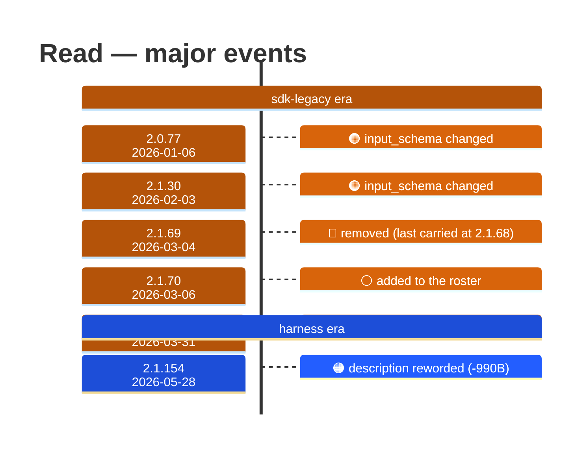

# Read

Generated 2026-08-14 by `bun run tool-docs` — regenerate, don't edit. Spine: `claude-opus-5`, sdk tree.

| | |
| --- | --- |
| first seen | 1.0.0 (2025-05-22) — present from the corpus start |
| status | **active** at 2.1.232 |
| versions present | 390 of 391 |
| description rewrites | 12 · schema changes: 3 |

Era colors: **amber** claude-code · **blue** sdk-legacy · **green** harness. Glyphs: ⚪ born · 🔴 removed · 🟠 rewrite/schema · 🔷 rename.

## Change log (all events)

| version | date | event |
| --- | --- | --- |
| 1.0.58 | 2025-07-22 | description reworded (+126B) |
| 1.0.68 | 2025-08-04 | description reworded (+69B) |
| 1.0.98 | 2025-08-29 | description reworded (+108B) |
| 2.0.2 | 2025-09-30 | description reworded (-113B) |
| 2.0.5 | 2025-10-02 | description reworded (+113B) |
| 2.0.8 | 2025-10-04 | description reworded (-113B) |
| 2.0.77 | 2026-01-06 | input_schema changed |
| 2.1.30 | 2026-02-03 | input_schema changed |
| 2.1.30 | 2026-02-03 | description reworded (+127B) |
| 2.1.69 | 2026-03-04 | removed (last carried at 2.1.68) |
| 2.1.70 | 2026-03-06 | added to the roster |
| 2.1.75 | 2026-03-13 | description reworded (-58B) |
| 2.1.84 | 2026-03-25 | description reworded (-141B) |
| 2.1.89 | 2026-03-31 | input_schema changed |
| 2.1.118 | 2026-04-22 | description reworded (+3B) |
| 2.1.128 | 2026-05-04 | description reworded (+149B) |
| 2.1.154 | 2026-05-28 | description reworded (-990B) |

## Variants at 2.1.232

2 distinct definitions:

- `claude-haiku-4-5`, `claude-opus-4-5`, `claude-opus-4-6`, `claude-opus-4-7`, `claude-sonnet-4-5`, `claude-sonnet-4-6`, `claude-sonnet-5`
- `claude-fable-5`, `claude-opus-4-8`, `claude-opus-5`

Lines the `claude-fable-5`, `claude-opus-4-8`, `claude-opus-5` variant lacks vs the majority:

> Reads a file from the local filesystem. You can access any file directly by using this tool.
> Assume this tool is able to read all files on the machine. If the User provides a path to a file assume that path is valid. It is okay to re
> - The file_path parameter must be an absolute path, not a relative path
> - By default, it reads up to 2000 lines starting from the beginning of the file
> - This tool allows Claude Code to read images (eg PNG, JPG, etc). When reading an image file the contents are presented visually as Claude C
> - This tool can read PDF files (.pdf). For large PDFs (more than 10 pages), you MUST provide the pages parameter to read specific page range
> - This tool can read Jupyter notebooks (.ipynb files) and returns all cells with their outputs, combining code, text, and visualizations.
> - This tool can only read files, not directories. To list files in a directory, use the registered shell tool.
> _…and 2 more_

