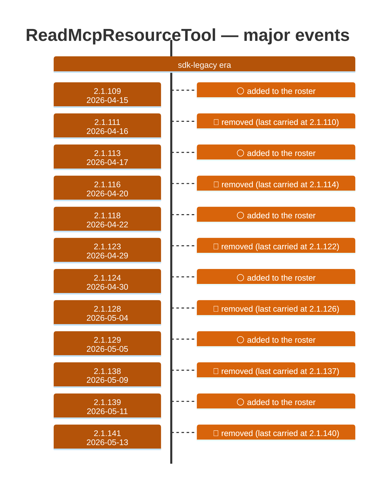

# ReadMcpResourceTool

Generated 2026-08-13 by `bun run tool-docs` — regenerate, don't edit. Spine: `claude-opus-5`, sdk tree.

| | |
| --- | --- |
| first seen | 2.1.109 (2026-04-15) |
| last seen | **removed** — last carried at 2.1.140 (2026-05-12) |
| versions present | 19 of 389 |
| description rewrites | 0 · schema changes: 0 |

Era colors: **amber** claude-code · **blue** sdk-legacy · **green** harness. Glyphs: ⚪ born · 🔴 removed · 🟠 rewrite/schema · 🔷 rename.

## Change log (all events)

| version | date | event |
| --- | --- | --- |
| 2.1.109 | 2026-04-15 | added to the roster |
| 2.1.111 | 2026-04-16 | removed (last carried at 2.1.110) |
| 2.1.113 | 2026-04-17 | added to the roster |
| 2.1.116 | 2026-04-20 | removed (last carried at 2.1.114) |
| 2.1.118 | 2026-04-22 | added to the roster |
| 2.1.123 | 2026-04-29 | removed (last carried at 2.1.122) |
| 2.1.124 | 2026-04-30 | added to the roster |
| 2.1.128 | 2026-05-04 | removed (last carried at 2.1.126) |
| 2.1.129 | 2026-05-05 | added to the roster |
| 2.1.138 | 2026-05-09 | removed (last carried at 2.1.137) |
| 2.1.139 | 2026-05-11 | added to the roster |
| 2.1.141 | 2026-05-13 | removed (last carried at 2.1.140) |

