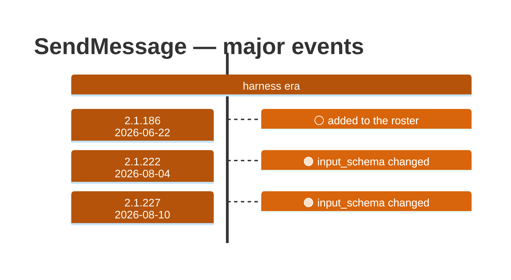

# SendMessage

Generated 2026-08-14 by `bun run tool-docs` — regenerate, don't edit. Spine: `claude-opus-5`, sdk tree.

| | |
| --- | --- |
| first seen | 2.1.186 (2026-06-22) |
| status | **active** at 2.1.229 |
| versions present | 40 of 389 |
| description rewrites | 2 · schema changes: 2 |

Era colors: **amber** claude-code · **blue** sdk-legacy · **green** harness. Glyphs: ⚪ born · 🔴 removed · 🟠 rewrite/schema · 🔷 rename.

## Change log (all events)

| version | date | event |
| --- | --- | --- |
| 2.1.186 | 2026-06-22 | added to the roster |
| 2.1.199 | 2026-07-02 | description reworded (+77B) |
| 2.1.203 | 2026-07-07 | description reworded (+48B) |
| 2.1.222 | 2026-08-04 | input_schema changed |
| 2.1.227 | 2026-08-10 | input_schema changed |

## Variants at 2.1.229

One definition across all 10 models.

