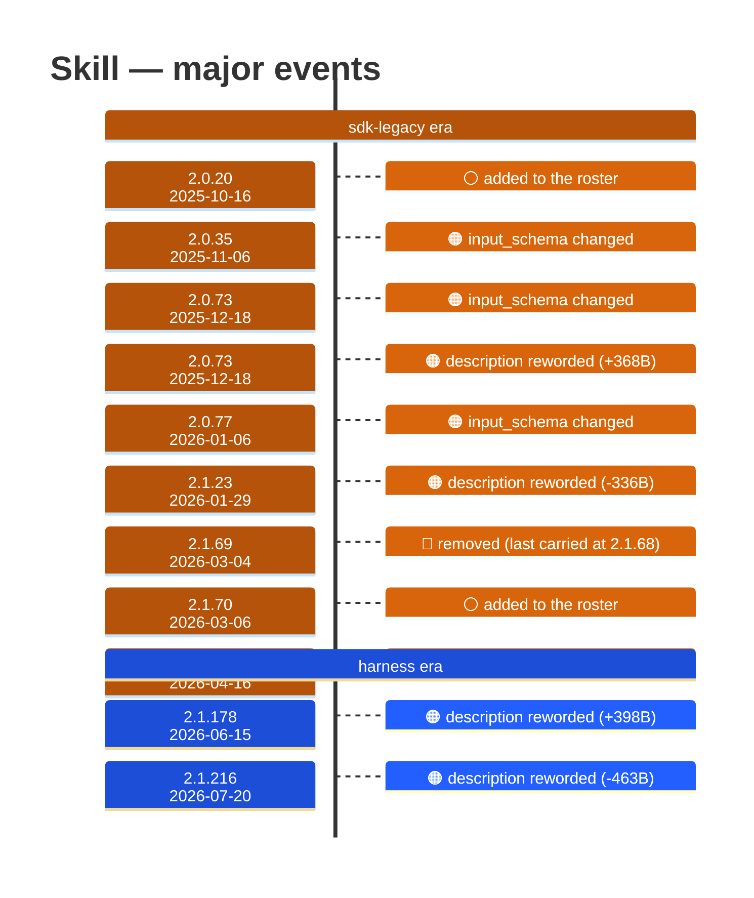

# Skill

Generated 2026-08-14 by `bun run tool-docs` — regenerate, don't edit. Spine: `claude-opus-5`, sdk tree.

| | |
| --- | --- |
| first seen | 2.0.20 (2025-10-16) |
| status | **active** at 2.1.229 |
| versions present | 251 of 389 |
| description rewrites | 10 · schema changes: 4 |

Era colors: **amber** claude-code · **blue** sdk-legacy · **green** harness. Glyphs: ⚪ born · 🔴 removed · 🟠 rewrite/schema · 🔷 rename.

## Change log (all events)

| version | date | event |
| --- | --- | --- |
| 2.0.20 | 2025-10-16 | added to the roster |
| 2.0.35 | 2025-11-06 | input_schema changed |
| 2.0.36 | 2025-11-07 | description reworded (-6B) |
| 2.0.62 | 2025-12-09 | description reworded (+82B) |
| 2.0.73 | 2025-12-18 | input_schema changed |
| 2.0.73 | 2025-12-18 | description reworded (+368B) |
| 2.0.77 | 2026-01-06 | input_schema changed |
| 2.0.77 | 2026-01-06 | description reworded (+191B) |
| 2.1.19 | 2026-01-23 | description reworded (-2B) |
| 2.1.23 | 2026-01-29 | description reworded (-336B) |
| 2.1.69 | 2026-03-04 | removed (last carried at 2.1.68) |
| 2.1.70 | 2026-03-06 | added to the roster |
| 2.1.111 | 2026-04-16 | input_schema changed |
| 2.1.111 | 2026-04-16 | description reworded (+43B) |
| 2.1.178 | 2026-06-15 | description reworded (+398B) |
| 2.1.216 | 2026-07-20 | description reworded (-463B) |
| 2.1.218 | 2026-07-22 | description reworded (+175B) |

## Variants at 2.1.229

One definition across all 10 models.

