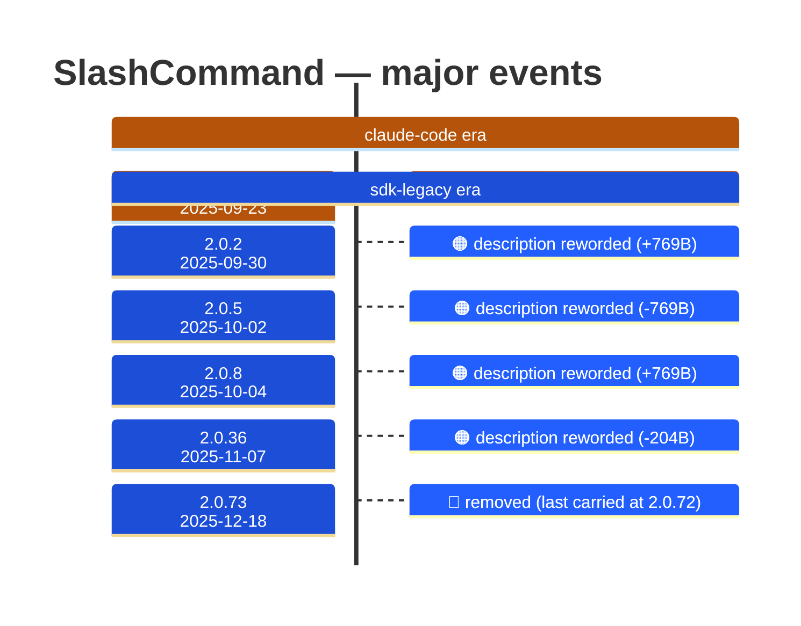

# SlashCommand

Generated 2026-08-14 by `bun run tool-docs` — regenerate, don't edit. Spine: `claude-opus-5`, sdk tree.

| | |
| --- | --- |
| first seen | 1.0.122 (2025-09-23) |
| last seen | **removed** — last carried at 2.0.72 (2025-12-17) |
| versions present | 72 of 389 |
| description rewrites | 5 · schema changes: 0 |

Era colors: **amber** claude-code · **blue** sdk-legacy · **green** harness. Glyphs: ⚪ born · 🔴 removed · 🟠 rewrite/schema · 🔷 rename.

## Change log (all events)

| version | date | event |
| --- | --- | --- |
| 1.0.122 | 2025-09-23 | added to the roster |
| 2.0.2 | 2025-09-30 | description reworded (+769B) |
| 2.0.5 | 2025-10-02 | description reworded (-769B) |
| 2.0.8 | 2025-10-04 | description reworded (+769B) |
| 2.0.12 | 2025-10-09 | description reworded (+182B) |
| 2.0.36 | 2025-11-07 | description reworded (-204B) |
| 2.0.73 | 2025-12-18 | removed (last carried at 2.0.72) |

