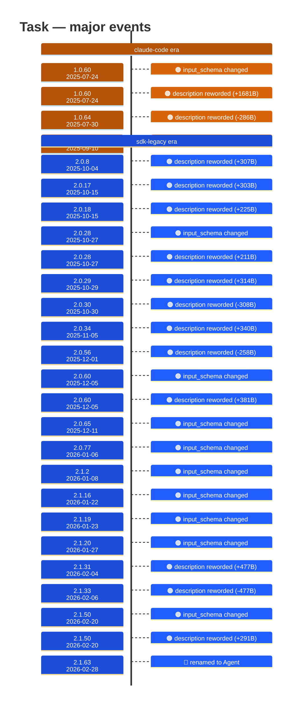

# Task

Generated 2026-08-14 by `bun run tool-docs` — regenerate, don't edit. Spine: `claude-opus-5`, sdk tree.

| | |
| --- | --- |
| first seen | 1.0.0 (2025-05-22) — present from the corpus start |
| last seen | **removed** — last carried at 2.1.62 (2026-02-27) |
| versions present | 247 of 389 |
| description rewrites | 35 · schema changes: 10 |

Era colors: **amber** claude-code · **blue** sdk-legacy · **green** harness. Glyphs: ⚪ born · 🔴 removed · 🟠 rewrite/schema · 🔷 rename.

## Change log (all events)

| version | date | event |
| --- | --- | --- |
| 1.0.16 | 2025-06-06 | description reworded (+68B) |
| 1.0.19 | 2025-06-10 | description reworded (+16B) |
| 1.0.25 | 2025-06-16 | description reworded (+70B) |
| 1.0.44 | 2025-07-07 | description reworded (-10B) |
| 1.0.57 | 2025-07-21 | description reworded (-2B) |
| 1.0.60 | 2025-07-24 | input_schema changed |
| 1.0.60 | 2025-07-24 | description reworded (+1681B) |
| 1.0.64 | 2025-07-30 | description reworded (-286B) |
| 1.0.71 | 2025-08-07 | description reworded (+111B) |
| 1.0.72 | 2025-08-08 | description reworded (+1B) |
| 1.0.74 | 2025-08-12 | description reworded (+110B) |
| 1.0.78 | 2025-08-13 | description reworded (+2B) |
| 1.0.81 | 2025-08-14 | description reworded (+6B) |
| 1.0.98 | 2025-08-29 | description reworded (-6B) |
| 1.0.111 | 2025-09-10 | description reworded (+291B) |
| 2.0.8 | 2025-10-04 | description reworded (+307B) |
| 2.0.17 | 2025-10-15 | description reworded (+303B) |
| 2.0.18 | 2025-10-15 | description reworded (+225B) |
| 2.0.28 | 2025-10-27 | input_schema changed |
| 2.0.28 | 2025-10-27 | description reworded (+211B) |
| 2.0.29 | 2025-10-29 | description reworded (+314B) |
| 2.0.30 | 2025-10-30 | description reworded (-308B) |
| 2.0.34 | 2025-11-05 | description reworded (+340B) |
| 2.0.56 | 2025-12-01 | description reworded (-258B) |
| 2.0.60 | 2025-12-05 | input_schema changed |
| 2.0.60 | 2025-12-05 | description reworded (+381B) |
| 2.0.62 | 2025-12-09 | description reworded (+179B) |
| 2.0.65 | 2025-12-11 | input_schema changed |
| 2.0.65 | 2025-12-11 | description reworded (-10B) |
| 2.0.72 | 2025-12-17 | description reworded (+84B) |
| 2.0.77 | 2026-01-06 | input_schema changed |
| 2.0.77 | 2026-01-06 | description reworded (+140B) |
| 2.1.2 | 2026-01-08 | input_schema changed |
| 2.1.7 | 2026-01-13 | description reworded (+106B) |
| 2.1.16 | 2026-01-22 | input_schema changed |
| 2.1.19 | 2026-01-23 | input_schema changed |
| 2.1.20 | 2026-01-27 | input_schema changed |
| 2.1.30 | 2026-02-03 | description reworded (-1B) |
| 2.1.31 | 2026-02-04 | description reworded (+477B) |
| 2.1.33 | 2026-02-06 | description reworded (-477B) |
| 2.1.38 | 2026-02-10 | description reworded (-4B) |
| 2.1.48 | 2026-02-19 | description reworded (+124B) |
| 2.1.50 | 2026-02-20 | input_schema changed |
| 2.1.50 | 2026-02-20 | description reworded (+291B) |
| 2.1.53 | 2026-02-24 | description reworded (-101B) |
| 2.1.63 | 2026-02-28 | renamed to Agent |

