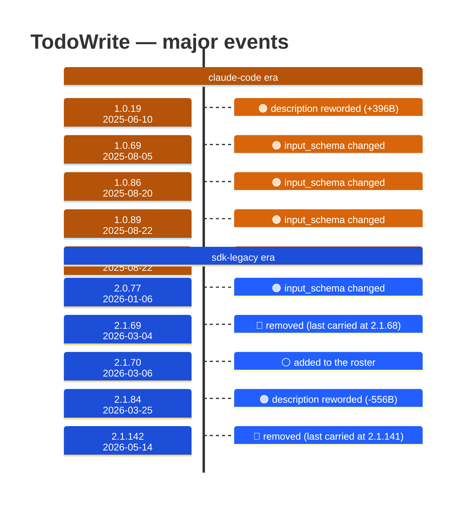

# TodoWrite

Generated 2026-08-13 by `bun run tool-docs` — regenerate, don't edit. Spine: `claude-opus-5`, sdk tree.

| | |
| --- | --- |
| first seen | 1.0.0 (2025-05-22) — present from the corpus start |
| last seen | **removed** — last carried at 2.1.141 (2026-05-13) |
| versions present | 310 of 389 |
| description rewrites | 6 · schema changes: 4 |

Era colors: **amber** claude-code · **blue** sdk-legacy · **green** harness. Glyphs: ⚪ born · 🔴 removed · 🟠 rewrite/schema · 🔷 rename.

## Change log (all events)

| version | date | event |
| --- | --- | --- |
| 1.0.8 | 2025-06-02 | description reworded (-11B) |
| 1.0.19 | 2025-06-10 | description reworded (+396B) |
| 1.0.69 | 2025-08-05 | input_schema changed |
| 1.0.86 | 2025-08-20 | input_schema changed |
| 1.0.86 | 2025-08-20 | description reworded (+27B) |
| 1.0.89 | 2025-08-22 | input_schema changed |
| 1.0.89 | 2025-08-22 | description reworded (+433B) |
| 2.0.77 | 2026-01-06 | input_schema changed |
| 2.1.63 | 2026-02-28 | description reworded (-31B) |
| 2.1.69 | 2026-03-04 | removed (last carried at 2.1.68) |
| 2.1.70 | 2026-03-06 | added to the roster |
| 2.1.84 | 2026-03-25 | description reworded (-556B) |
| 2.1.142 | 2026-05-14 | removed (last carried at 2.1.141) |

