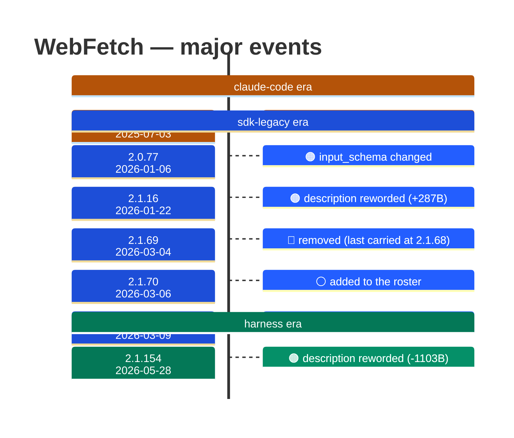

# WebFetch

Generated 2026-08-13 by `bun run tool-docs` — regenerate, don't edit. Spine: `claude-opus-5`, sdk tree.

| | |
| --- | --- |
| first seen | 1.0.0 (2025-05-22) — present from the corpus start |
| status | **active** at 2.1.229 |
| versions present | 388 of 389 |
| description rewrites | 6 · schema changes: 1 |

Era colors: **amber** claude-code · **blue** sdk-legacy · **green** harness. Glyphs: ⚪ born · 🔴 removed · 🟠 rewrite/schema · 🔷 rename.

## Change log (all events)

| version | date | event |
| --- | --- | --- |
| 1.0.42 | 2025-07-03 | description reworded (+209B) |
| 2.0.62 | 2025-12-09 | description reworded (-43B) |
| 2.0.77 | 2026-01-06 | input_schema changed |
| 2.1.14 | 2026-01-20 | description reworded (+105B) |
| 2.1.16 | 2026-01-22 | description reworded (+287B) |
| 2.1.69 | 2026-03-04 | removed (last carried at 2.1.68) |
| 2.1.70 | 2026-03-06 | added to the roster |
| 2.1.72 | 2026-03-09 | description reworded (+262B) |
| 2.1.154 | 2026-05-28 | description reworded (-1103B) |

## Variants at 2.1.229

2 distinct definitions:

- `claude-haiku-4-5`, `claude-opus-4-5`, `claude-opus-4-6`, `claude-opus-4-7`, `claude-sonnet-4-5`, `claude-sonnet-4-6`, `claude-sonnet-5`
- `claude-fable-5`, `claude-opus-4-8`, `claude-opus-5`

Lines the `claude-fable-5`, `claude-opus-4-8`, `claude-opus-5` variant lacks vs the majority:

> IMPORTANT: WebFetch WILL FAIL for authenticated or private URLs. Before using this tool, check if the URL points to an authenticated service
> - Fetches content from a specified URL and processes it using an AI model
> - Takes a URL and a prompt as input
> - Fetches the URL content, converts HTML to markdown
> - Processes the content with the prompt using a small, fast model
> - Returns the model's response about the content
> - Use this tool when you need to retrieve and analyze web content
> - IMPORTANT: If an MCP-provided web fetch tool is available, prefer using that tool instead of this one, as it may have fewer restrictions.
> _…and 8 more_

