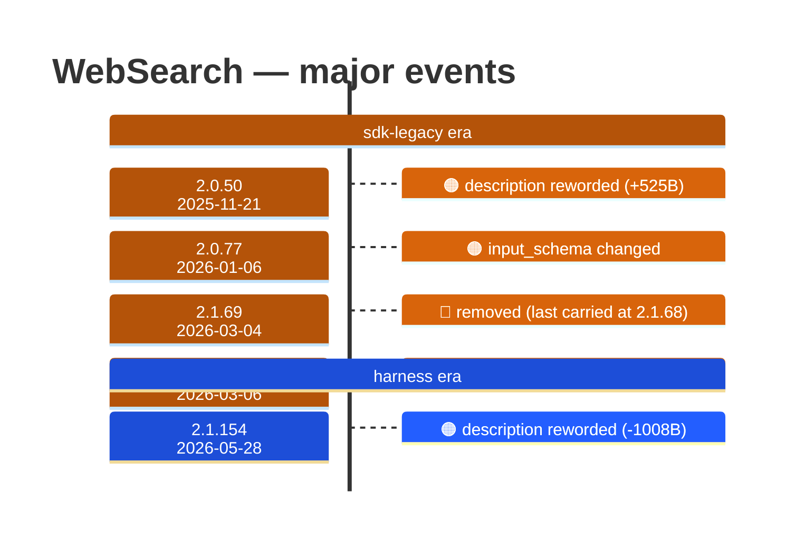

# WebSearch

Generated 2026-08-14 by `bun run tool-docs` — regenerate, don't edit. Spine: `claude-opus-5`, sdk tree.

| | |
| --- | --- |
| first seen | 1.0.0 (2025-05-22) — present from the corpus start |
| status | **active** at 2.1.229 |
| versions present | 388 of 389 |
| description rewrites | 7 · schema changes: 1 |

Era colors: **amber** claude-code · **blue** sdk-legacy · **green** harness. Glyphs: ⚪ born · 🔴 removed · 🟠 rewrite/schema · 🔷 rename.

## Change log (all events)

| version | date | event |
| --- | --- | --- |
| 1.0.36 | 2025-06-27 | description reworded (+40B) |
| 1.0.40 | 2025-07-01 | description reworded (+139B) |
| 2.0.50 | 2025-11-21 | description reworded (+525B) |
| 2.0.56 | 2025-12-01 | description reworded (+151B) |
| 2.0.77 | 2026-01-06 | input_schema changed |
| 2.1.8 | 2026-01-15 | description reworded (-24B) |
| 2.1.42 | 2026-02-13 | description reworded (+6B) |
| 2.1.69 | 2026-03-04 | removed (last carried at 2.1.68) |
| 2.1.70 | 2026-03-06 | added to the roster |
| 2.1.154 | 2026-05-28 | description reworded (-1008B) |

## Variants at 2.1.229

2 distinct definitions:

- `claude-haiku-4-5`, `claude-opus-4-5`, `claude-opus-4-6`, `claude-opus-4-7`, `claude-sonnet-4-5`, `claude-sonnet-4-6`, `claude-sonnet-5`
- `claude-fable-5`, `claude-opus-4-8`, `claude-opus-5`

Lines the `claude-fable-5`, `claude-opus-4-8`, `claude-opus-5` variant lacks vs the majority:

> - Allows Claude to search the web and use the results to inform responses
> - Provides up-to-date information for current events and recent data
> - Returns search result information formatted as search result blocks, including links as markdown hyperlinks
> - Use this tool for accessing information beyond Claude's knowledge cutoff
> - Searches are performed automatically within a single API call
> CRITICAL REQUIREMENT - You MUST follow this:
> - After answering the user's question, you MUST include a "Sources:" section at the end of your response
> - In the Sources section, list all relevant URLs from the search results as markdown hyperlinks: [Title](URL)
> _…and 8 more_

