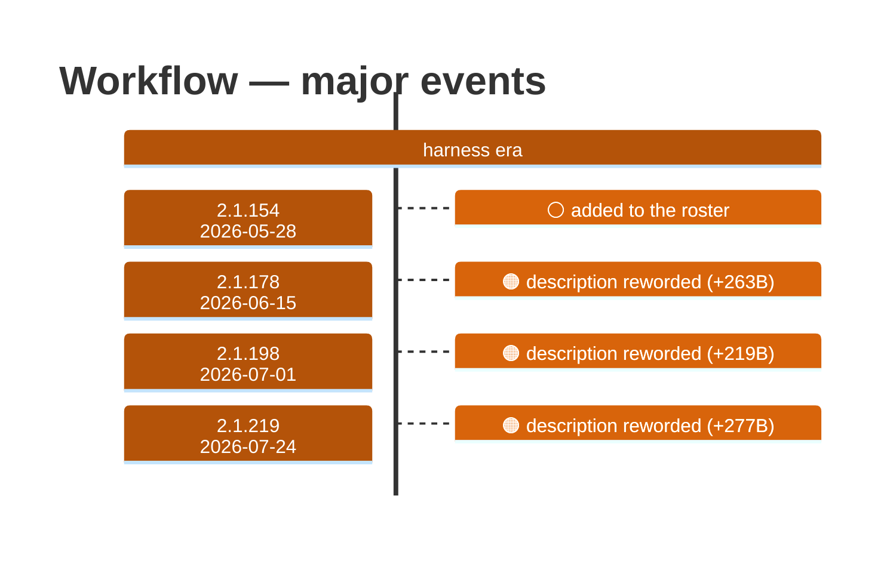

# Workflow

Generated 2026-08-14 by `bun run tool-docs` — regenerate, don't edit. Spine: `claude-opus-5`, sdk tree.

| | |
| --- | --- |
| first seen | 2.1.154 (2026-05-28) |
| status | **active** at 2.1.232 |
| versions present | 69 of 391 |
| description rewrites | 8 · schema changes: 0 |

Era colors: **amber** claude-code · **blue** sdk-legacy · **green** harness. Glyphs: ⚪ born · 🔴 removed · 🟠 rewrite/schema · 🔷 rename.

## Change log (all events)

| version | date | event |
| --- | --- | --- |
| 2.1.154 | 2026-05-28 | added to the roster |
| 2.1.160 | 2026-06-01 | description reworded (+51B) |
| 2.1.163 | 2026-06-04 | description reworded (+124B) |
| 2.1.166 | 2026-06-05 | description reworded (+59B) |
| 2.1.178 | 2026-06-15 | description reworded (+263B) |
| 2.1.198 | 2026-07-01 | description reworded (+219B) |
| 2.1.217 | 2026-07-21 | description reworded (+15B) |
| 2.1.219 | 2026-07-24 | description reworded (+277B) |
| 2.1.229 | 2026-08-12 | description reworded (+5B) |

## Variants at 2.1.232

One definition across all 10 models.

