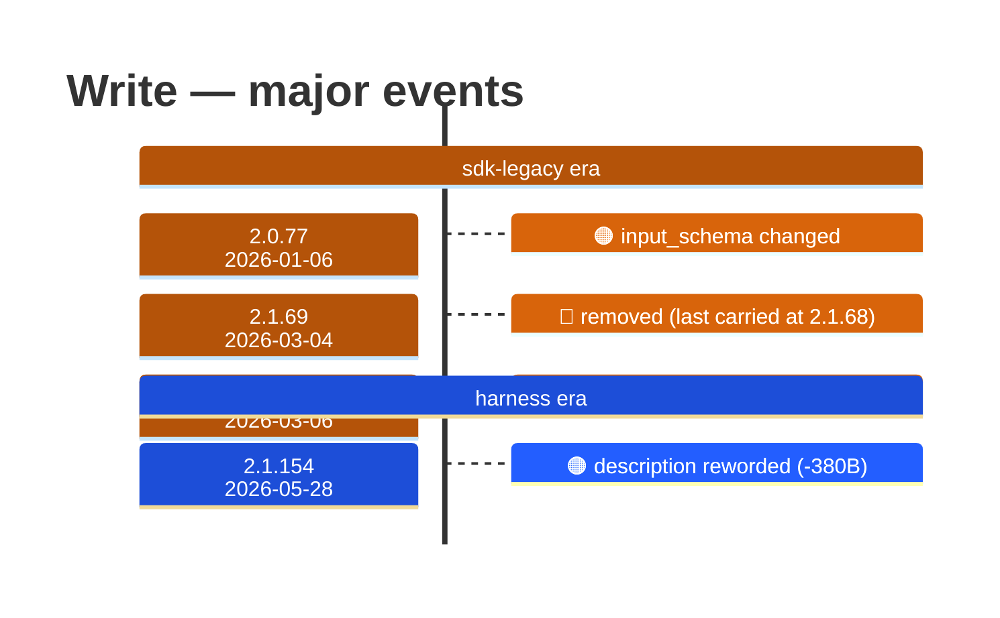

# Write

Generated 2026-08-13 by `bun run tool-docs` — regenerate, don't edit. Spine: `claude-opus-5`, sdk tree.

| | |
| --- | --- |
| first seen | 1.0.0 (2025-05-22) — present from the corpus start |
| status | **active** at 2.1.229 |
| versions present | 388 of 389 |
| description rewrites | 3 · schema changes: 1 |

Era colors: **amber** claude-code · **blue** sdk-legacy · **green** harness. Glyphs: ⚪ born · 🔴 removed · 🟠 rewrite/schema · 🔷 rename.

## Change log (all events)

| version | date | event |
| --- | --- | --- |
| 1.0.7 | 2025-05-30 | description reworded (+98B) |
| 2.0.77 | 2026-01-06 | input_schema changed |
| 2.1.53 | 2026-02-24 | description reworded (-2B) |
| 2.1.69 | 2026-03-04 | removed (last carried at 2.1.68) |
| 2.1.70 | 2026-03-06 | added to the roster |
| 2.1.154 | 2026-05-28 | description reworded (-380B) |

## Variants at 2.1.229

2 distinct definitions:

- `claude-haiku-4-5`, `claude-opus-4-5`, `claude-opus-4-6`, `claude-opus-4-7`, `claude-sonnet-4-5`, `claude-sonnet-4-6`, `claude-sonnet-5`
- `claude-fable-5`, `claude-opus-4-8`, `claude-opus-5`

Lines the `claude-fable-5`, `claude-opus-4-8`, `claude-opus-5` variant lacks vs the majority:

> Writes a file to the local filesystem.
> - This tool will overwrite the existing file if there is one at the provided path.
> - If this is an existing file, you MUST use the Read tool first to read the file's contents. This tool will fail if you did not read the fil
> - Prefer the Edit tool for modifying existing files — it only sends the diff. Only use this tool to create new files or for complete rewrite
> - NEVER create documentation files (*.md) or README files unless explicitly requested by the User.
> - Only use emojis if the user explicitly requests it. Avoid writing emojis to files unless asked.

