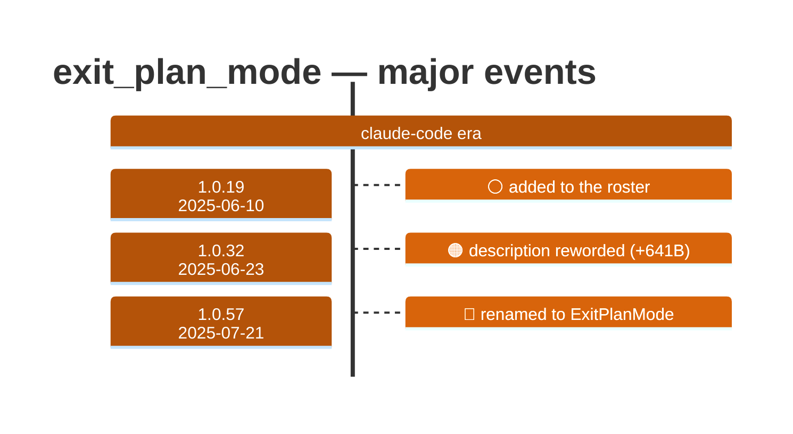

# exit_plan_mode

Generated 2026-08-13 by `bun run tool-docs` — regenerate, don't edit. Spine: `claude-opus-5`, sdk tree.

| | |
| --- | --- |
| first seen | 1.0.19 (2025-06-10) |
| last seen | **removed** — last carried at 1.0.56 (2025-07-18) |
| versions present | 38 of 389 |
| description rewrites | 1 · schema changes: 0 |

Era colors: **amber** claude-code · **blue** sdk-legacy · **green** harness. Glyphs: ⚪ born · 🔴 removed · 🟠 rewrite/schema · 🔷 rename.

## Change log (all events)

| version | date | event |
| --- | --- | --- |
| 1.0.19 | 2025-06-10 | added to the roster |
| 1.0.32 | 2025-06-23 | description reworded (+641B) |
| 1.0.57 | 2025-07-21 | renamed to ExitPlanMode |

